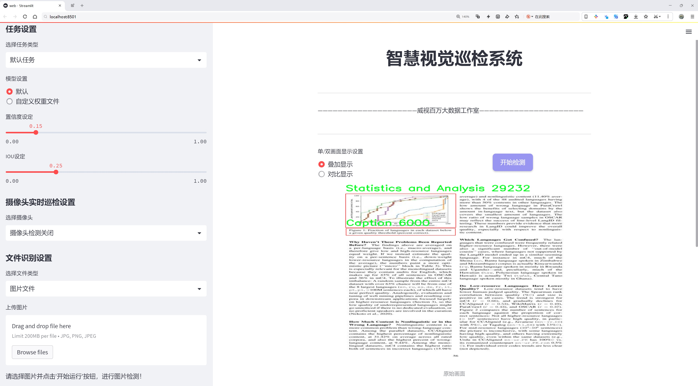

# 论文内容分类与检测检测系统源码分享
 # [一条龙教学YOLOV8标注好的数据集一键训练_70+全套改进创新点发刊_Web前端展示]

### 1.研究背景与意义

项目参考[AAAI Association for the Advancement of Artificial Intelligence](https://gitee.com/qunshansj/projects)

项目来源[AACV Association for the Advancement of Computer Vision](https://gitee.com/qunmasj/projects)

研究背景与意义

随着信息技术的迅猛发展，学术论文的数量和复杂性不断增加，如何高效地对论文内容进行分类与检测已成为一个亟待解决的问题。传统的人工分类方法不仅耗时耗力，而且容易受到主观因素的影响，导致分类结果的不一致性和准确性不足。因此，基于计算机视觉和深度学习技术的自动化内容分类与检测系统的研究显得尤为重要。在这一背景下，YOLO（You Only Look Once）系列模型因其在目标检测任务中的高效性和准确性，逐渐成为研究者们的关注焦点。

YOLOv8作为YOLO系列的最新版本，具有更强的特征提取能力和更快的推理速度，能够在复杂场景中实现实时目标检测。通过对YOLOv8的改进，我们可以针对学术论文的特定需求，设计出一个高效的内容分类与检测系统。该系统不仅能够识别论文中的不同内容类型，如算法、代码、流程图、图表、模型架构等，还能为研究者提供更为直观的论文结构分析，帮助他们快速获取所需信息。

本研究将使用一个包含5000张图像的数据集，该数据集涵盖了12个类别，包括算法、代码或流程图、标题、比较、图示、图表、插图和示例、模型架构、模型性能与指标、概述/过程、管道、真实图像以及统计与分析等。这些类别的多样性为模型的训练和评估提供了丰富的素材，能够有效提升模型的泛化能力和分类准确性。

通过改进YOLOv8模型，我们旨在实现以下几个目标：首先，提升模型在不同类别内容检测中的准确性，尤其是在处理复杂背景和多样化格式的学术论文时；其次，优化模型的推理速度，以满足实时应用的需求；最后，构建一个用户友好的界面，使研究者能够方便地上传论文并获取分类结果，从而提高学术研究的效率。

此外，本研究的意义还在于推动学术界对自动化内容分析技术的应用。随着学术论文数量的不断增加，研究者面临的信息过载问题愈发严重。通过构建基于改进YOLOv8的论文内容分类与检测系统，我们不仅可以为研究者提供高效的信息检索工具，还能为学术界的知识管理和信息组织提供新的思路和方法。这将有助于提升学术研究的效率，促进知识的传播与共享，最终推动科学研究的进步。

综上所述，基于改进YOLOv8的论文内容分类与检测系统的研究具有重要的理论意义和实际应用价值。它不仅为解决学术论文分类与检测问题提供了新的技术路径，也为信息技术在学术领域的深入应用奠定了基础。随着该系统的不断完善与推广，预计将对学术研究的各个领域产生深远的影响。

### 2.图片演示





##### 注意：由于此博客编辑较早，上面“2.图片演示”和“3.视频演示”展示的系统图片或者视频可能为老版本，新版本在老版本的基础上升级如下：（实际效果以升级的新版本为准）

  （1）适配了YOLOV8的“目标检测”模型和“实例分割”模型，通过加载相应的权重（.pt）文件即可自适应加载模型。

  （2）支持“图片识别”、“视频识别”、“摄像头实时识别”三种识别模式。

  （3）支持“图片识别”、“视频识别”、“摄像头实时识别”三种识别结果保存导出，解决手动导出（容易卡顿出现爆内存）存在的问题，识别完自动保存结果并导出到tempDir中。

  （4）支持Web前端系统中的标题、背景图等自定义修改，后面提供修改教程。

  另外本项目提供训练的数据集和训练教程,暂不提供权重文件（best.pt）,需要您按照教程进行训练后实现图片演示和Web前端界面演示的效果。

### 3.视频演示

[3.1 视频演示](https://www.bilibili.com/video/BV1RL4oeVEEv/)

### 4.数据集信息展示

##### 4.1 本项目数据集详细数据（类别数＆类别名）

nc: 11
names: ['Algorithm-code or flowchart', 'Caption', 'Diagram', 'Graph-plots', 'Illustrations and examples', 'Model architecture', 'Model performance and metrics', 'Overview-procedure', 'Pipeline', 'Real image', 'Statistics and Analysis']


##### 4.2 本项目数据集信息介绍

数据集信息展示

在本研究中，我们采用了名为“figcap”的数据集，以支持对YOLOv8模型的改进，旨在提升其在内容分类与检测系统中的表现。该数据集包含11个不同的类别，涵盖了多种与学术论文相关的视觉信息类型。这些类别的多样性不仅为模型提供了丰富的训练样本，也为其在实际应用中的泛化能力奠定了基础。

首先，数据集中包含的“Algorithm-code or flowchart”类别，主要用于识别和分类算法的代码示例或流程图。这一类别对于理解算法的实现和流程至关重要，能够帮助研究人员快速把握复杂的计算过程。此外，“Caption”类别则专注于图像或图表的说明文字，能够有效地辅助模型理解图像内容与其描述之间的关系，从而提升信息检索的准确性。

在数据集的另一部分，“Diagram”类别提供了各种类型的图示，这些图示通常用于阐述复杂的概念或过程，能够帮助用户在视觉上更好地理解研究内容。与此同时，“Graph-plots”类别则专注于各种图表和数据可视化，涵盖了线图、柱状图、饼图等多种形式，这些图表通常用于展示实验结果或数据分析，能够为模型提供丰富的视觉信息。

“Illustrations and examples”类别则包含了各种插图和示例，这些内容通常用于支持理论或方法的说明，能够帮助用户更直观地理解研究的背景和应用。而“Model architecture”类别则专注于模型的结构图，能够帮助研究人员理解不同模型之间的差异和优劣，为后续的模型选择和改进提供依据。

此外，“Model performance and metrics”类别则记录了模型的性能指标和评估结果，这对于研究人员在模型改进过程中进行对比分析具有重要意义。通过分析不同模型在相同数据集上的表现，研究人员能够更好地识别出改进的方向和重点。

“Overview-procedure”类别则提供了研究的整体流程图，帮助用户快速了解研究的主要步骤和方法。而“Pipeline”类别则展示了数据处理和模型训练的具体流程，能够为研究人员提供清晰的工作框架。

在数据集的最后两个类别中，“Real image”主要用于展示真实图像，这些图像通常与研究主题密切相关，能够为模型提供真实世界中的数据样本。而“Statistics and Analysis”类别则聚焦于统计数据和分析结果，这些信息对于研究的结论和后续的研究方向具有重要的指导意义。

综上所述，“figcap”数据集通过其丰富的类别设置，为YOLOv8模型的训练提供了全面的支持。每个类别不仅在内容上具有独特性，而且在模型的学习过程中相互补充，形成了一个完整的知识体系。这种多样化的数据来源，不仅能够提升模型的分类与检测能力，还能够为学术研究提供更为精准和高效的工具，推动相关领域的进一步发展。通过对该数据集的深入分析与应用，我们期望能够实现对YOLOv8模型的有效改进，从而为内容分类与检测系统的研究提供更为坚实的基础。


### 5.全套项目环境部署视频教程（零基础手把手教学）

[5.1 环境部署教程链接（零基础手把手教学）](https://www.ixigua.com/7404473917358506534?logTag=c807d0cbc21c0ef59de5)


[5.2 安装Python虚拟环境创建和依赖库安装视频教程链接（零基础手把手教学）](https://www.ixigua.com/7404474678003106304?logTag=1f1041108cd1f708b01a)

### 6.手把手YOLOV8训练视频教程（零基础小白有手就能学会）

[6.1 手把手YOLOV8训练视频教程（零基础小白有手就能学会）](https://www.ixigua.com/7404477157818401292?logTag=d31a2dfd1983c9668658)

### 7.70+种全套YOLOV8创新点代码加载调参视频教程（一键加载写好的改进模型的配置文件）

[7.1 70+种全套YOLOV8创新点代码加载调参视频教程（一键加载写好的改进模型的配置文件）](https://www.ixigua.com/7404478314661806627?logTag=29066f8288e3f4eea3a4)

### 8.70+种全套YOLOV8创新点原理讲解（非科班也可以轻松写刊发刊，V10版本正在科研待更新）

由于篇幅限制，每个创新点的具体原理讲解就不一一展开，具体见下列网址中的创新点对应子项目的技术原理博客网址【Blog】：


[8.1 70+种全套YOLOV8创新点原理讲解链接](https://gitee.com/qunmasj/good)

### 9.系统功能展示（检测对象为举例，实际内容以本项目数据集为准）

图9.1.系统支持检测结果表格显示

  图9.2.系统支持置信度和IOU阈值手动调节

  图9.3.系统支持自定义加载权重文件best.pt(需要你通过步骤5中训练获得)

  图9.4.系统支持摄像头实时识别

  图9.5.系统支持图片识别

  图9.6.系统支持视频识别

  图9.7.系统支持识别结果文件自动保存

  图9.8.系统支持Excel导出检测结果数据


### 10.原始YOLOV8算法原理

原始YOLOv8算法原理

YOLOv8算法是Ultralytics公司在2023年发布的最新版本，代表了YOLO系列在目标检测领域的又一次重大进步。与之前的版本相比，YOLOv8在网络结构、性能优化和损失函数等多个方面进行了创新和改进，旨在实现更高的检测精度和更快的处理速度。YOLOv8的设计理念是将目标检测任务简化为一个端到端的过程，避免了传统方法中复杂的区域提议和滑动窗口技术，从而提高了检测的效率和准确性。

YOLOv8的网络结构主要由输入端、主干网络和检测端三部分组成。以YOLOv8n为例，其网络结构经过精心设计，采用了CSP（Cross Stage Partial）结构，将特征提取过程分为两个部分，分别进行卷积和连接。这种设计不仅提高了特征提取的效率，还增强了模型的表达能力。此外，YOLOv8n在主干网络中引入了C2f模块，这一模块是对YOLOv5中C3模块的改进，结合了YOLOv7中的ELAN模块的思想，增加了更多的残差连接。这种创新使得C2f模块在保持轻量化的同时，能够获得更加丰富的梯度信息，从而提高了模型的训练效果和检测性能。

在特征融合方面，YOLOv8继续采用PAN-FPN（Path Aggregation Network - Feature Pyramid Network）结构，通过多尺度特征的融合来增强模型对不同尺寸目标的检测能力。PAN-FPN结构的优势在于能够有效地整合来自不同层次的特征信息，使得模型在处理复杂场景时，能够更好地捕捉到目标的细节和上下文信息。这种特征融合策略对于提高目标检测的精度至关重要，尤其是在处理具有高度变异性的目标时。

YOLOv8在检测端的设计上也进行了显著的创新。与传统的Anchor-Based方法不同，YOLOv8采用了Anchor-Free的检测方式，这一策略的优势在于简化了模型的设计，同时提高了检测的灵活性。通过解耦合头结构，YOLOv8将分类和检测任务分离，使得模型在进行目标分类和定位时能够更加高效。这种解耦合的设计理念使得YOLOv8在处理复杂场景时，能够更好地应对目标重叠和遮挡等问题。

在训练过程中，YOLOv8引入了动态Task-Aligned Assigner样本分配策略，并在数据增强方面进行了优化，特别是在最后10个epoch中关闭了马赛克增强。这一策略的实施使得模型在训练时能够更好地适应不同的样本分布，从而提高了模型的泛化能力。此外，YOLOv8在损失函数的设计上也进行了创新，采用了BCELoss作为分类损失，DFLLoss和CIoULoss作为回归损失。这种多损失函数的组合策略，使得模型在训练过程中能够更好地平衡分类和定位的精度，从而提高整体的检测性能。

YOLOv8的性能在多个标准数据集上进行了评估，结果显示其在精度和速度上均有显著提升。与SSD等传统目标检测算法相比，YOLOv8在mAP（mean Average Precision）上提高了43.23%，同时帧率也提升了10.28倍。这一系列的性能提升使得YOLOv8在智能监控、自动驾驶和人脸识别等应用场景中展现出了广泛的适用性和优越性。

综上所述，YOLOv8算法通过对网络结构的深度优化、特征融合策略的改进以及损失函数的创新，成功实现了目标检测性能的全面提升。其设计理念和技术创新不仅推动了YOLO系列算法的发展，也为目标检测领域的研究提供了新的思路和方向。随着YOLOv8的广泛应用，未来在更多实际场景中的表现值得期待。


### 11.项目核心源码讲解（再也不用担心看不懂代码逻辑）

#### 11.1 code\ultralytics\models\yolo\classify\__init__.py

下面是对给定代码的核心部分进行分析和详细注释的结果：

```python
# Ultralytics YOLO 🚀, AGPL-3.0 license

# 从 ultralytics 库中导入用于分类的预测、训练和验证模块
from ultralytics.models.yolo.classify.predict import ClassificationPredictor  # 导入分类预测器
from ultralytics.models.yolo.classify.train import ClassificationTrainer      # 导入分类训练器
from ultralytics.models.yolo.classify.val import ClassificationValidator      # 导入分类验证器

# 定义模块的公开接口，包含三个核心类
__all__ = "ClassificationPredictor", "ClassificationTrainer", "ClassificationValidator"
```

### 代码分析

1. **导入模块**：
   - `ClassificationPredictor`：用于进行图像分类的预测，通常会使用训练好的模型对新图像进行分类。
   - `ClassificationTrainer`：用于训练分类模型，负责处理训练数据、模型构建、损失计算等。
   - `ClassificationValidator`：用于验证分类模型的性能，通常在训练后使用验证集来评估模型的准确性。

2. **`__all__` 声明**：
   - `__all__` 是一个特殊变量，用于定义模块的公共接口。只有在使用 `from module import *` 时，列出的名称才会被导入。这里列出了三个核心类，表明它们是该模块的主要功能部分。

### 总结
该代码片段是 Ultralytics YOLO 项目的一部分，主要用于图像分类任务。通过导入和公开这三个核心类，用户可以方便地进行模型的训练、预测和验证。

这个文件是Ultralytics YOLO项目中的一个初始化文件，位于`code/ultralytics/models/yolo/classify/`目录下。文件的主要功能是导入与分类相关的模块，并定义了该模块的公共接口。

首先，文件开头的注释表明这是Ultralytics YOLO项目的一部分，并且该项目遵循AGPL-3.0许可证。这意味着该项目是开源的，用户可以自由使用和修改，但需要遵循相应的许可证条款。

接下来，文件导入了三个类：`ClassificationPredictor`、`ClassificationTrainer`和`ClassificationValidator`。这些类分别用于分类任务中的预测、训练和验证。具体来说：

- `ClassificationPredictor`类可能负责处理模型的预测功能，即输入数据后输出分类结果。
- `ClassificationTrainer`类则用于训练分类模型，通常包括数据加载、模型训练、损失计算等功能。
- `ClassificationValidator`类用于验证训练好的模型的性能，通常会评估模型在验证集上的表现。

最后，`__all__`变量定义了该模块的公共接口，指定了在使用`from module import *`语句时可以导入的类。这有助于控制模块的命名空间，确保只暴露必要的部分给外部使用者。

总的来说，这个初始化文件的作用是将分类相关的功能模块整合在一起，方便其他部分的代码进行调用和使用。

#### 11.2 ui.py

```python
import sys
import subprocess

def run_script(script_path):
    """
    使用当前 Python 环境运行指定的脚本。

    Args:
        script_path (str): 要运行的脚本路径

    Returns:
        None
    """
    # 获取当前 Python 解释器的路径
    python_path = sys.executable

    # 构建运行命令
    command = f'"{python_path}" -m streamlit run "{script_path}"'

    # 执行命令
    result = subprocess.run(command, shell=True)
    if result.returncode != 0:
        print("脚本运行出错。")


# 实例化并运行应用
if __name__ == "__main__":
    # 指定您的脚本路径
    script_path = "web.py"  # 这里直接指定脚本路径

    # 运行脚本
    run_script(script_path)
```

### 代码注释说明：

1. **导入模块**：
   - `import sys`：导入 sys 模块，用于访问与 Python 解释器相关的变量和函数。
   - `import subprocess`：导入 subprocess 模块，用于执行外部命令。

2. **定义函数 `run_script`**：
   - 该函数接收一个参数 `script_path`，表示要运行的 Python 脚本的路径。
   - 使用 `sys.executable` 获取当前 Python 解释器的路径，以确保在正确的环境中运行脚本。
   - 构建一个命令字符串 `command`，该命令使用 `streamlit` 模块运行指定的脚本。
   - 使用 `subprocess.run` 执行构建的命令，并通过 `shell=True` 允许在 shell 中执行命令。
   - 检查命令的返回码，如果不为 0，表示脚本运行出错，打印错误信息。

3. **主程序块**：
   - `if __name__ == "__main__":`：确保只有在直接运行该脚本时才会执行以下代码。
   - 指定要运行的脚本路径 `script_path`，这里直接设置为 `"web.py"`。
   - 调用 `run_script` 函数，传入脚本路径以运行该脚本。

这个程序文件名为 `ui.py`，其主要功能是通过当前的 Python 环境运行一个指定的脚本。程序的实现过程如下：

首先，文件导入了必要的模块，包括 `sys`、`os` 和 `subprocess`，这些模块提供了与系统交互的功能。此外，还导入了 `QtFusion.path` 模块中的 `abs_path` 函数，用于获取脚本的绝对路径。

接下来，定义了一个名为 `run_script` 的函数，该函数接受一个参数 `script_path`，表示要运行的脚本的路径。在函数内部，首先通过 `sys.executable` 获取当前 Python 解释器的路径，这样可以确保使用正确的 Python 环境来运行脚本。

然后，构建了一个命令字符串 `command`，该命令使用 `streamlit` 模块来运行指定的脚本。`streamlit` 是一个用于构建数据应用的库，命令格式为 `python -m streamlit run script_path`。

使用 `subprocess.run` 方法执行构建的命令，并通过 `shell=True` 参数在 shell 中运行该命令。执行后，检查返回码 `result.returncode`，如果返回码不为 0，表示脚本运行过程中出现了错误，程序会打印出“脚本运行出错”的提示信息。

在文件的最后部分，使用 `if __name__ == "__main__":` 判断程序是否是直接运行的，如果是，则指定要运行的脚本路径，这里使用 `abs_path("web.py")` 获取 `web.py` 的绝对路径。最后，调用 `run_script` 函数来执行这个脚本。

总体来说，这个程序的作用是简化通过 Python 环境运行 `web.py` 脚本的过程，并提供了错误处理机制。

#### 11.3 code\ultralytics\models\yolo\classify\train.py

以下是代码中最核心的部分，并附上详细的中文注释：

```python
import torch
from ultralytics.data import ClassificationDataset, build_dataloader
from ultralytics.engine.trainer import BaseTrainer
from ultralytics.models import yolo
from ultralytics.nn.tasks import ClassificationModel, attempt_load_one_weight
from ultralytics.utils import DEFAULT_CFG, LOGGER, RANK, colorstr
from ultralytics.utils.torch_utils import is_parallel, strip_optimizer, torch_distributed_zero_first

class ClassificationTrainer(BaseTrainer):
    """
    继承自 BaseTrainer 类的分类训练器，用于基于分类模型的训练。
    """

    def __init__(self, cfg=DEFAULT_CFG, overrides=None, _callbacks=None):
        """初始化 ClassificationTrainer 对象，支持配置覆盖和回调函数。"""
        if overrides is None:
            overrides = {}
        overrides["task"] = "classify"  # 设置任务类型为分类
        if overrides.get("imgsz") is None:
            overrides["imgsz"] = 224  # 默认图像大小为224
        super().__init__(cfg, overrides, _callbacks)  # 调用父类构造函数

    def set_model_attributes(self):
        """从加载的数据集中设置 YOLO 模型的类名。"""
        self.model.names = self.data["names"]

    def get_model(self, cfg=None, weights=None, verbose=True):
        """返回配置好的 PyTorch 模型以用于 YOLO 的训练。"""
        model = ClassificationModel(cfg, nc=self.data["nc"], verbose=verbose and RANK == -1)  # 创建分类模型
        if weights:
            model.load(weights)  # 加载权重

        for m in model.modules():
            if not self.args.pretrained and hasattr(m, "reset_parameters"):
                m.reset_parameters()  # 重置模型参数
            if isinstance(m, torch.nn.Dropout) and self.args.dropout:
                m.p = self.args.dropout  # 设置 dropout 概率
        for p in model.parameters():
            p.requires_grad = True  # 设置参数为可训练
        return model

    def build_dataset(self, img_path, mode="train", batch=None):
        """根据图像路径和模式（训练/测试等）创建 ClassificationDataset 实例。"""
        return ClassificationDataset(root=img_path, args=self.args, augment=mode == "train", prefix=mode)

    def get_dataloader(self, dataset_path, batch_size=16, rank=0, mode="train"):
        """返回用于推理的 PyTorch DataLoader，并进行图像预处理。"""
        with torch_distributed_zero_first(rank):  # 在分布式训练中，确保数据集只初始化一次
            dataset = self.build_dataset(dataset_path, mode)  # 构建数据集

        loader = build_dataloader(dataset, batch_size, self.args.workers, rank=rank)  # 创建 DataLoader
        return loader

    def preprocess_batch(self, batch):
        """预处理一批图像和类标签。"""
        batch["img"] = batch["img"].to(self.device)  # 将图像移动到设备上
        batch["cls"] = batch["cls"].to(self.device)  # 将类标签移动到设备上
        return batch

    def get_validator(self):
        """返回 ClassificationValidator 实例以进行验证。"""
        self.loss_names = ["loss"]  # 定义损失名称
        return yolo.classify.ClassificationValidator(self.test_loader, self.save_dir, _callbacks=self.callbacks)

    def final_eval(self):
        """评估训练后的模型并保存验证结果。"""
        for f in self.last, self.best:
            if f.exists():
                strip_optimizer(f)  # 去除优化器信息
                if f is self.best:
                    LOGGER.info(f"\nValidating {f}...")  # 记录验证信息
                    self.metrics = self.validator(model=f)  # 进行验证
                    self.metrics.pop("fitness", None)  # 移除不需要的指标
        LOGGER.info(f"Results saved to {colorstr('bold', self.save_dir)}")  # 记录结果保存路径
```

### 代码说明：
1. **导入必要的库**：导入 PyTorch 和 Ultralytics 中的相关模块，以便后续使用。
2. **ClassificationTrainer 类**：继承自 `BaseTrainer`，用于分类任务的训练。
3. **初始化方法**：设置任务类型为分类，并定义默认的图像大小。
4. **模型属性设置**：从数据集中获取类名并设置到模型中。
5. **获取模型**：根据配置和权重加载并返回一个分类模型。
6. **构建数据集**：根据给定的图像路径和模式创建数据集实例。
7. **获取数据加载器**：创建并返回用于训练或验证的 PyTorch DataLoader。
8. **预处理批次**：将图像和类标签移动到指定设备上进行训练。
9. **获取验证器**：返回用于验证的分类验证器实例。
10. **最终评估**：评估训练后的模型并保存验证结果。

这些核心部分构成了分类训练的基本框架，能够支持模型的训练、验证和评估。

这个程序文件是一个用于训练分类模型的Python脚本，属于Ultralytics YOLO框架的一部分。它主要实现了一个名为`ClassificationTrainer`的类，该类继承自`BaseTrainer`，用于处理图像分类任务。

在文件的开头，导入了一些必要的库和模块，包括PyTorch、Torchvision以及Ultralytics框架中的各种工具和类。这些导入为后续的模型训练和数据处理提供了基础。

`ClassificationTrainer`类的构造函数`__init__`接收配置参数、覆盖参数和回调函数。它设置了任务类型为“分类”，并确保图像大小默认为224。如果没有提供图像大小，程序会自动设置为224。

`set_model_attributes`方法用于从加载的数据集中设置YOLO模型的类名，以便在训练过程中使用。

`get_model`方法返回一个经过修改的PyTorch模型，适用于YOLO训练。它会根据传入的权重加载模型，并设置模型的参数以便于训练。这里还包括对Dropout层的处理，以便根据需要调整其丢弃率。

`setup_model`方法负责加载、创建或下载模型。如果模型已经加载，则不需要再进行设置。该方法支持从本地文件、Torchvision模型或Ultralytics资产中加载YOLO模型。如果模型文件不存在，程序会抛出错误。

`build_dataset`方法根据给定的图像路径和模式（如训练或测试）创建一个`ClassificationDataset`实例。

`get_dataloader`方法返回一个PyTorch的DataLoader，用于对图像进行预处理并准备进行推理。它会根据分布式训练的需要初始化数据集，并在训练模式下附加必要的转换。

`preprocess_batch`方法用于对一批图像和类别进行预处理，将其移动到指定的设备上（如GPU）。

`progress_string`方法返回一个格式化的字符串，显示训练进度，包括当前的epoch、GPU内存使用情况和损失值等信息。

`get_validator`方法返回一个`ClassificationValidator`实例，用于验证模型的性能。它设置了损失名称，以便在训练过程中进行跟踪。

`label_loss_items`方法返回一个带有标签的损失字典，尽管在分类任务中不需要，但在分割和检测任务中是必要的。

`plot_metrics`方法用于从CSV文件中绘制训练过程中的指标，并保存结果图像。

`final_eval`方法在训练结束后评估模型并保存验证结果。它会检查最后和最佳模型文件是否存在，并进行相应的验证和日志记录。

最后，`plot_training_samples`方法用于绘制训练样本及其注释，以便可视化训练过程中的数据。

整体来看，这个脚本提供了一个完整的框架，用于训练和评估基于YOLO的图像分类模型，涵盖了数据处理、模型设置、训练过程监控和结果可视化等多个方面。

#### 11.4 code\ultralytics\models\yolo\__init__.py

以下是代码中最核心的部分，并附上详细的中文注释：

```python
# 导入Ultralytics YOLO模型的相关功能
from ultralytics.models.yolo import classify, detect, obb, pose, segment

# 从当前模块导入YOLO类
from .model import YOLO

# 定义模块的公开接口，包含分类、检测、倾斜边界框、姿态估计、分割和YOLO类
__all__ = "classify", "segment", "detect", "pose", "obb", "YOLO"
```

### 代码注释说明：

1. **导入YOLO模型功能**：
   - `from ultralytics.models.yolo import classify, detect, obb, pose, segment`：从`ultralytics`库中导入YOLO模型的不同功能模块，包括分类（classify）、目标检测（detect）、倾斜边界框（obb）、姿态估计（pose）和图像分割（segment）。这些功能是YOLO模型的核心应用。

2. **导入YOLO类**：
   - `from .model import YOLO`：从当前模块的`model`文件中导入YOLO类，这个类可能包含YOLO模型的具体实现和方法。

3. **定义模块的公开接口**：
   - `__all__ = "classify", "segment", "detect", "pose", "obb", "YOLO"`：这个特殊变量`__all__`定义了当使用`from module import *`时，哪些名称会被导入。这里列出了所有的功能模块和YOLO类，确保用户可以方便地访问这些功能。

这个程序文件是Ultralytics YOLO模型的初始化文件，文件名为`__init__.py`，它的主要作用是定义该模块的公共接口。首先，文件顶部的注释表明这是Ultralytics YOLO项目的一部分，并且使用的是AGPL-3.0许可证，这意味着该代码是开源的，并且可以自由使用和修改，但在分发时需要遵循相应的许可证条款。

接下来，文件通过`from`语句导入了多个功能模块，包括`classify`（分类）、`detect`（检测）、`obb`（有向边界框）、`pose`（姿态估计）和`segment`（分割）。这些模块分别实现了YOLO模型的不同功能，用户可以根据需要调用相应的功能进行图像处理和分析。

最后，`__all__`变量定义了模块的公共接口，包含了导入的功能模块名称和`YOLO`类。这意味着当使用`from ultralytics.models.yolo import *`语句时，只会导入这些指定的名称，从而避免不必要的命名冲突或暴露内部实现细节。

总体来说，这个文件是Ultralytics YOLO模型的一个重要组成部分，通过组织和导出模块，使得用户能够方便地使用YOLO的各种功能。

#### 11.5 train.py

以下是经过简化和注释的核心代码部分，主要集中在YOLO模型的训练过程和数据处理上：

```python
import random
import numpy as np
import torch.nn as nn
from ultralytics.data import build_dataloader, build_yolo_dataset
from ultralytics.engine.trainer import BaseTrainer
from ultralytics.models import yolo
from ultralytics.nn.tasks import DetectionModel
from ultralytics.utils import LOGGER, RANK
from ultralytics.utils.torch_utils import de_parallel, torch_distributed_zero_first

class DetectionTrainer(BaseTrainer):
    """
    基于检测模型的训练类，继承自BaseTrainer类。
    """

    def build_dataset(self, img_path, mode="train", batch=None):
        """
        构建YOLO数据集。

        参数:
            img_path (str): 包含图像的文件夹路径。
            mode (str): 模式，可以是'train'或'val'，用户可以为每种模式自定义不同的增强。
            batch (int, optional): 批次大小，仅用于'rect'模式。默认为None。
        """
        gs = max(int(de_parallel(self.model).stride.max() if self.model else 0), 32)  # 获取模型的最大步幅
        return build_yolo_dataset(self.args, img_path, batch, self.data, mode=mode, rect=mode == "val", stride=gs)

    def get_dataloader(self, dataset_path, batch_size=16, rank=0, mode="train"):
        """构造并返回数据加载器。"""
        assert mode in ["train", "val"]  # 确保模式有效
        with torch_distributed_zero_first(rank):  # 在分布式训练中，仅初始化一次数据集
            dataset = self.build_dataset(dataset_path, mode, batch_size)
        shuffle = mode == "train"  # 训练模式下打乱数据
        workers = self.args.workers if mode == "train" else self.args.workers * 2  # 设置工作线程数
        return build_dataloader(dataset, batch_size, workers, shuffle, rank)  # 返回数据加载器

    def preprocess_batch(self, batch):
        """对图像批次进行预处理，包括缩放和转换为浮点数。"""
        batch["img"] = batch["img"].to(self.device, non_blocking=True).float() / 255  # 将图像转换为浮点数并归一化
        if self.args.multi_scale:  # 如果启用多尺度训练
            imgs = batch["img"]
            sz = (
                random.randrange(self.args.imgsz * 0.5, self.args.imgsz * 1.5 + self.stride)
                // self.stride
                * self.stride
            )  # 随机选择新的图像大小
            sf = sz / max(imgs.shape[2:])  # 计算缩放因子
            if sf != 1:
                ns = [
                    math.ceil(x * sf / self.stride) * self.stride for x in imgs.shape[2:]
                ]  # 计算新的形状
                imgs = nn.functional.interpolate(imgs, size=ns, mode="bilinear", align_corners=False)  # 进行插值
            batch["img"] = imgs  # 更新批次图像
        return batch

    def get_model(self, cfg=None, weights=None, verbose=True):
        """返回YOLO检测模型。"""
        model = DetectionModel(cfg, nc=self.data["nc"], verbose=verbose and RANK == -1)  # 创建检测模型
        if weights:
            model.load(weights)  # 加载权重
        return model

    def plot_training_samples(self, batch, ni):
        """绘制带有注释的训练样本。"""
        plot_images(
            images=batch["img"],
            batch_idx=batch["batch_idx"],
            cls=batch["cls"].squeeze(-1),
            bboxes=batch["bboxes"],
            paths=batch["im_file"],
            fname=self.save_dir / f"train_batch{ni}.jpg",
            on_plot=self.on_plot,
        )

    def plot_metrics(self):
        """从CSV文件中绘制指标。"""
        plot_results(file=self.csv, on_plot=self.on_plot)  # 保存结果图
```

### 代码说明：
1. **DetectionTrainer类**：该类负责YOLO模型的训练，继承自`BaseTrainer`。
2. **build_dataset方法**：构建YOLO数据集，支持训练和验证模式。
3. **get_dataloader方法**：创建数据加载器，支持分布式训练。
4. **preprocess_batch方法**：对输入的图像批次进行预处理，包括归一化和多尺度调整。
5. **get_model方法**：返回YOLO检测模型，并可选择加载预训练权重。
6. **plot_training_samples和plot_metrics方法**：用于可视化训练样本和训练过程中的指标。 

这些方法是YOLO模型训练的核心部分，负责数据准备、模型构建和训练过程中的可视化。

这个程序文件 `train.py` 是一个用于训练 YOLO（You Only Look Once）目标检测模型的实现，继承自 `BaseTrainer` 类。程序的主要功能是构建数据集、加载数据、预处理图像、设置模型属性、获取模型、验证模型、记录损失、绘制训练样本和绘制训练指标等。

在程序开始部分，导入了一些必要的库和模块，包括数学运算、随机数生成、深度学习框架 PyTorch 相关的模块，以及 Ultralytics 提供的 YOLO 相关功能模块。

`DetectionTrainer` 类是程序的核心，包含多个方法来实现训练过程中的不同步骤。首先，`build_dataset` 方法用于构建 YOLO 数据集，接收图像路径、模式（训练或验证）和批次大小作为参数。它会根据模型的步幅计算合适的大小，并调用 `build_yolo_dataset` 函数来生成数据集。

接下来，`get_dataloader` 方法用于构建数据加载器，确保在分布式训练时只初始化一次数据集。根据模式（训练或验证），它会设置数据加载的参数，如是否打乱数据、工作线程的数量等。

`preprocess_batch` 方法负责对输入的图像批次进行预处理，包括将图像缩放到合适的大小并转换为浮点数格式。这个过程还考虑了多尺度训练的需求，通过随机选择图像大小来增强模型的鲁棒性。

`set_model_attributes` 方法用于设置模型的属性，包括类别数量和类别名称等，以确保模型能够正确处理输入数据。

`get_model` 方法返回一个 YOLO 检测模型的实例，并可选择加载预训练权重。`get_validator` 方法则返回一个用于验证模型性能的验证器。

在训练过程中，`label_loss_items` 方法用于记录训练损失的各个项，并返回一个包含损失信息的字典。`progress_string` 方法返回一个格式化的字符串，用于显示训练进度，包括当前的 epoch、GPU 内存使用情况、损失值等信息。

此外，程序还包含绘图功能，`plot_training_samples` 方法用于绘制训练样本及其标注，`plot_metrics` 方法用于从 CSV 文件中绘制训练指标，`plot_training_labels` 方法则用于创建带有标签的训练图像。

总体而言，这个程序文件实现了 YOLO 模型的训练流程，涵盖了数据准备、模型构建、训练过程中的损失记录和结果可视化等多个方面，适合用于目标检测任务的深度学习训练。

#### 11.6 70+种YOLOv8算法改进源码大全和调试加载训练教程（非必要）\ultralytics\trackers\__init__.py

以下是代码中最核心的部分，并附上详细的中文注释：

```python
# 导入所需的跟踪器类
from .bot_sort import BOTSORT  # 导入BOTSORT类，用于目标跟踪
from .byte_tracker import BYTETracker  # 导入BYTETracker类，用于目标跟踪
from .track import register_tracker  # 导入注册跟踪器的函数

# 定义可供外部访问的模块成员
__all__ = 'register_tracker', 'BOTSORT', 'BYTETracker'  # 允许简化导入，指定外部可访问的类和函数
```

### 注释说明：
1. **导入部分**：
   - `from .bot_sort import BOTSORT`：从当前包中导入 `BOTSORT` 类，`BOTSORT` 是一种用于目标跟踪的算法。
   - `from .byte_tracker import BYTETracker`：从当前包中导入 `BYTETracker` 类，`BYTETracker` 也是一种目标跟踪算法，通常用于实时跟踪任务。
   - `from .track import register_tracker`：从当前包中导入 `register_tracker` 函数，用于注册跟踪器，使其可以在其他模块中使用。

2. **`__all__` 变量**：
   - `__all__` 是一个特殊变量，用于定义当使用 `from module import *` 语句时，哪些名称会被导入。这里指定了 `register_tracker`、`BOTSORT` 和 `BYTETracker`，使得这三个名称可以被外部模块访问，简化了导入过程。

这个程序文件是一个Python模块的初始化文件，属于Ultralytics YOLO项目的一部分，主要用于目标检测和跟踪。文件的开头有一个注释，指出这是Ultralytics YOLO的代码，并声明了其使用的AGPL-3.0许可证。

在文件中，首先从当前目录（即`ultralytics.trackers`）导入了三个组件：`BOTSORT`、`BYTETracker`和`register_tracker`。`BOTSORT`和`BYTETracker`是两种不同的目标跟踪算法，分别实现了不同的跟踪逻辑和性能优化。`register_tracker`是一个函数，用于注册这些跟踪器，使得在其他模块中可以方便地使用它们。

最后，`__all__`变量被定义为一个包含字符串的元组，列出了该模块公开的接口。这意味着当使用`from module import *`语句时，只会导入`register_tracker`、`BOTSORT`和`BYTETracker`这三个名称。这种做法有助于控制模块的可见性，避免不必要的名称冲突，同时也使得模块的使用更加简洁明了。

总的来说，这个文件的主要功能是组织和导出与目标跟踪相关的功能，使得其他模块可以方便地进行导入和使用。

### 12.系统整体结构（节选）

### 整体功能和构架概括

Ultralytics YOLO项目是一个用于目标检测和分类的深度学习框架，支持多种模型和算法的实现。该项目的整体架构包括多个模块，每个模块负责特定的功能，如模型训练、推理、数据处理和结果可视化等。通过这些模块的组合，用户可以方便地进行目标检测、分类、跟踪等任务。

- **模型模块**：实现YOLO模型的各类功能，包括分类、检测、姿态估计等。
- **训练模块**：提供训练和验证模型的功能，支持多种数据集和配置。
- **工具模块**：包括数据处理、可视化、回调函数等实用工具，增强了模型的使用体验。
- **用户界面**：提供简单的用户界面，方便用户运行和调试模型。

以下是每个文件的功能整理表格：

| 文件路径                                                                                               | 功能描述                                                         |
|------------------------------------------------------------------------------------------------------|----------------------------------------------------------------|
| `code/ultralytics/models/yolo/classify/__init__.py`                                                | 初始化分类模块，导入分类相关的类和功能。                               |
| `ui.py`                                                                                              | 提供一个简单的用户界面，运行指定的脚本（如`web.py`）。                 |
| `code/ultralytics/models/yolo/classify/train.py`                                                   | 实现分类模型的训练过程，包括数据集构建、模型设置和训练监控等功能。         |
| `code/ultralytics/models/yolo/__init__.py`                                                         | 初始化YOLO模型模块，导入检测、分类、分割等功能模块。                     |
| `train.py`                                                                                           | 训练YOLO目标检测模型，处理数据集、模型设置和训练过程。                     |
| `70+种YOLOv8算法改进源码大全和调试加载训练教程（非必要）/ultralytics/trackers/__init__.py`         | 初始化目标跟踪模块，导入BOTSORT和BYTETracker等跟踪算法。                 |
| `code/ultralytics/engine/exporter.py`                                                               | 负责导出训练好的模型，支持不同格式的模型导出。                           |
| `70+种YOLOv8算法改进源码大全和调试加载训练教程（非必要）/ultralytics/models/yolo/detect/train.py` | 实现YOLO目标检测模型的训练过程，类似于分类训练模块。                      |
| `code/ultralytics/models/yolo/pose/val.py`                                                         | 负责姿态估计模型的验证过程，评估模型在验证集上的表现。                     |
| `70+种YOLOv8算法改进源码大全和调试加载训练教程（非必要）/ultralytics/nn/modules/block.py`          | 定义神经网络模块中的基本构建块，支持模型的构建和训练。                     |
| `code/ultralytics/nn/modules/transformer.py`                                                       | 实现Transformer结构，可能用于改进YOLO模型的特征提取能力。                  |
| `code/ultralytics/utils/tal.py`                                                                     | 提供实用工具和函数，可能用于数据处理和模型评估。                           |
| `70+种YOLOv8算法改进源码大全和调试加载训练教程（非必要）/ultralytics/utils/callbacks/hub.py`       | 定义回调函数，支持模型训练过程中的监控和日志记录。                         |

这个表格概述了每个文件的主要功能，帮助用户理解Ultralytics YOLO项目的结构和各个模块的作用。

注意：由于此博客编辑较早，上面“11.项目核心源码讲解（再也不用担心看不懂代码逻辑）”中部分代码可能会优化升级，仅供参考学习，完整“训练源码”、“Web前端界面”和“70+种创新点源码”以“13.完整训练+Web前端界面+70+种创新点源码、数据集获取”的内容为准。

### 13.完整训练+Web前端界面+70+种创新点源码、数据集获取


# [下载链接：https://mbd.pub/o/bread/ZpuWkpdq](https://mbd.pub/o/bread/ZpuWkpdq)